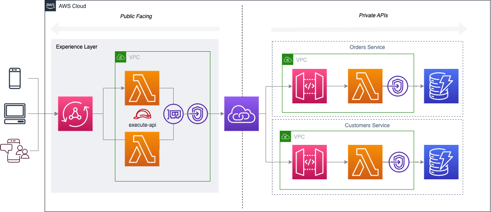

# Serverless GraphQL API Federation
An example of using AWS AppSync to federate multiple private Amazon API Gateways with direct integration


The article for this repo can be found here: https://medium.com/@leejamesgilmore/serverless-graphql-api-federation-5ab5ab24324

## Getting started

We are going to build the following:



As you can see this follows SAL Architecture (Serverless Architecture Layers), where we have an experience in the Experience Layer (i.e. our AppSync GraphQL API), which federates calls to private domain APIs in the Domain Layer.

## Deploying the solution

To deploy the solution perform the following:

1. Add your own aws profile to three `cdk.json` files.

2. Deploy the customers domain service
```
cd golden-ipa-customers && npm run deploy
```

3. Deploy the orders domain service
```
cd golden-ipa-orders && npm run deploy
```

4. Deploy the experience layer graphQL api
```
cd golden-ipa-experience && npm run deploy
```

## Testing

You can use the following code to create a new customer:

```
mutation createCustomer {
  createCustomer(input: {firstName: "Lee", surname: "Gilmore"}) {
    id
    firstName
    surname
  }
}
```

You can then create a new order for the customer above using the following:

```
mutation createOrder {
  createOrder(input: {customerId: "548ec2c7-17d0-4101-90c8-41a2e0cc0047", productId: "LEE-123", quantity: 1}) {
    id
  }
}
```

And you can then query the customer you have just created using the following code which also returns the orders:

```
query getCustomer {
  getCustomer(id: "548ec2c7-17d0-4101-90c8-41a2e0cc0047") {
    id
    surname
    firstName
    orders {
      id
      productId
      quantity
    }
  }
}
```

## Tear down

You can tear down the stacks using the `npm run remove` command in the opposite order to the process of deploying above.